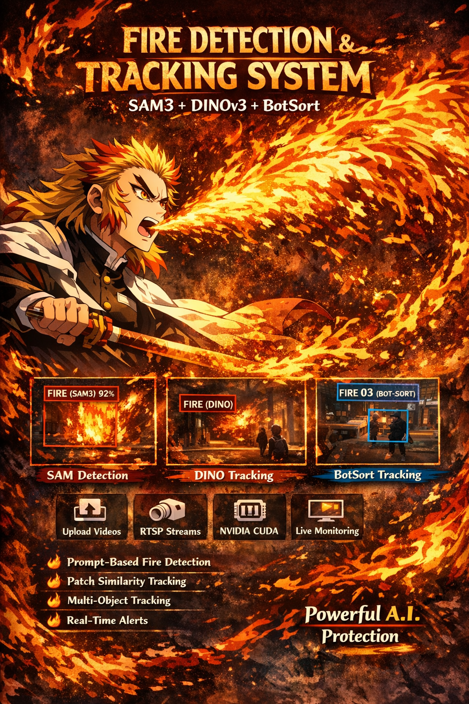

# 🔥 Fire Detection & Tracking System (SAM3 + DINOv3 + BotSort)

A real-time fire detection and tracking system that combines:
- **SAM3** for prompt-based fire detection
- **DINOv3** for patch similarity-based tracking
- **BotSort** for multi-object tracking
- **Gradio** for an interactive web interface

## 📋 Prerequisites

- Docker with NVIDIA GPU support (nvidia-docker2)
- NVIDIA GPU with CUDA support
- MinIO instance for frame storage
- At least 16GB RAM recommended

## 🚀 Quick Start

### 1. Build the Docker Image
```bash
docker build -t sam3-gradio:latest .
```

### 2. Run the Container
```bash
docker run -it --rm \
  --gpus all \
  --p 9007:9007 \
  sam3-gradio:latest
```

### 3. Access the Web Interface
Open your browser and navigate to:
```
http://localhost:9007
```

## 📁 Project Structure

```
├── app.py                    # Main application entry point
├── Dockerfile               # Docker configuration
├── requirements.txt         # Python dependencies
├── configs/                 # Configuration directory
│   └── config.yaml         # Main configuration file
├── output/                  # Processed video outputs
├── uploaded_videos/         # User-uploaded videos
├── src/
│   ├── frame_gather.py     # Frame synchronization module
│   ├── detector.py         # SAM3 detector implementation
│   └── dino.py             # DINOv3 patch similarity module
├── sam_model/              # SAM3 model files
└── dinov3-convnext-tiny-pretrain-lvd1689m/  # DINOv3 model
```

## ⚙️ Configuration

The system uses a YAML configuration file (`configs/config.yaml`):

```yaml
endpoint: 0.0.0.0:9000
access_key: minioadmin
secret_key: minioadmin123
bucket: detector-frames
buffer_size: 10
dashboard_alarm: http://192.168.7.41:5000/report
dashboard_ws: ws://0.0.0.0:8075
disconnect_timeout: 5
log_level: INFO
max_failures: 5
milvus_collection: main
milvus_service: http://0.0.0.0:19530/
output_dir: false
recognition_ws: ws://0.0.0.0:9100
search_service: None
sources:
  - id: 11
    url: ./uploaded_videos/example.mp4
```

## 🎮 Web Interface Features

### Video Sources
- **Upload File**: Upload local video files for processing
- **RTSP URL**: Connect to RTSP streams (e.g., IP cameras)
- **Auto-config**: Config file is automatically updated with selected source

### Controls
- **Start Processing**: Begin real-time fire detection and tracking
- **Stop**: Halt processing at any time
- **Live Preview**: Watch processed frames in real-time

### Visual Features
- **SAM Detection**: Red bounding boxes with confidence scores
- **DINO Tracking**: Red "FIRE (DINO)" annotations
- **BotSort Tracking**: Blue "FIRE (BOT-SORT)" with consistent track IDs
- **Status Overlay**: Current processing status and frame count

## 🔧 Technical Details

### Detection Pipeline
1. **Frame Capture**: Frames are synchronized using `FrameSynchronizer`
2. **SAM3 Detection**: Every `vlm_interval` seconds, SAM3 detects fire regions
3. **DINOv3 Tracking**: Uses patch similarity to track fire across frames
4. **BotSort Tracking**: Maintains consistent object IDs
5. **Annotation**: Overlays detection results on frames
6. **Output**: Saves processed video to `output/` directory

### Models Used
- **SAM3**: `sam_model/` (local directory with model files)
- **DINOv3**: `dinov3-convnext-tiny-pretrain-lvd1689m/` (pretrained on LVD1689M)
- **BotSort**: For multi-object tracking

### Performance
- **Detection Interval**: Configurable (default: 1 second)
- **Processing**: Real-time, depends on GPU capabilities
- **Memory**: GPU memory required for SAM3 and DINOv3 models

## 🐛 Troubleshooting

### Common Issues

1. **CUDA Out of Memory**
   - Reduce batch size in detection calls
   - Lower input resolution
   - Ensure sufficient GPU memory

2. **RTSP Connection Issues**
   - Verify network connectivity
   - Check RTSP URL format
   - Ensure proper authentication if required

3. **Model Loading Errors**
   - Verify model files exist in correct directories
   - Check HF_TOKEN environment variable for SAM3

4. **MinIO Connection Issues**
   - Verify MinIO endpoint is accessible
   - Check access key and secret key

### Logs
Check Docker logs for detailed error messages:
```bash
docker logs [container_id]
```

## 📊 Output

- **Processed Videos**: Saved to `./output/fire_tracking_[timestamp].mp4`
- **Detection Logs**: Printed to console with timestamps
- **Status Updates**: Displayed in web interface

## 🔄 Updating Models

To update SAM3 or DINOv3 models:
1. Replace files in respective directories
2. Update model paths in code if necessary
3. Rebuild Docker image

## 🤝 Contributing

1. Fork the repository
2. Create a feature branch
3. Commit changes
4. Push to branch
5. Create Pull Request

## 📄 License

See `LICENSE.md` for details.

## 🙏 Acknowledgments

- Meta AI for SAM3
- Facebook Research for DINOv3
- The BotSort maintainers
- Hugging Face for transformers library

---

**Note**: This system is designed for fire detection in controlled environments. Always verify detections with human oversight in critical applications.
